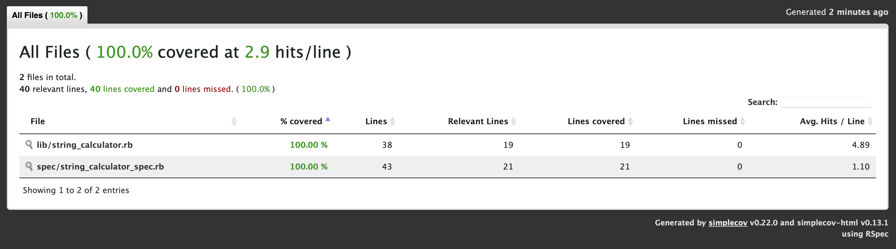

# String Calculator

A simple string calculator implementation in Ruby. This project is built using Test-Driven Development (TDD) with RSpec.

## Features

- **Addition of numbers from a string**: The calculator can sum numbers provided as a comma-separated string.
- **Custom delimiters**: Supports user-defined delimiters in the format `//[delimiter]
[numbers...]`.
- **Error handling**: Throws an exception when negative numbers are provided, listing all negative numbers in the error message.

## Installation

1. Clone the repository:

   ```bash
   git clone https://github.com/yourusername/string_calculator.git
   cd string_calculator
   ```

2. Install the dependencies:

   ```bash
   bundle install
   ```

## Usage

### String Calculator

The `StringCalculator` class provides the `add` method to sum numbers from a string.

```ruby
# Adding numbers from a string
puts StringCalculator.add('')         # => 0
puts StringCalculator.add('1,2,3')    # => 6
puts StringCalculator.add('1\n2,3')   # => 6 (Handles newlines as well)
puts StringCalculator.add('//;\n1;2') # => 3 (Supports custom delimiters)
```

### Running Tests

The project uses **RSpec** for testing. To run the tests, use:

```bash
bundle exec rspec
```

This will run all the tests in the `spec` directory.

### Code Coverage

The project uses **SimpleCov** to track code coverage. After running the tests, you can view the coverage report in the `coverage/` directory.

To view the report:

1. Run the tests:

   ```bash
   bundle exec rspec
   ```

2. Open the coverage report in your browser:

   ```bash
   open coverage/index.html  # On macOS
   xdg-open coverage/index.html  # On Linux
   start coverage/index.html  # On Windows
   ```

   

## RuboCop

The project uses **RuboCop** for code style enforcement. To run RuboCop and check the code style, use:

```bash
bundle exec rubocop
```

### Configuration

The `.rubocop.yml` file contains custom configuration, including enabling `rubocop-rspec` for RSpec-specific checks.

## Contributing

Feel free to fork the repository, create a branch, and submit a pull request with improvements or bug fixes. Please make sure to write tests for any new features or changes.

## License

This project is licensed under the MIT License - see the [LICENSE](LICENSE) file for details.
